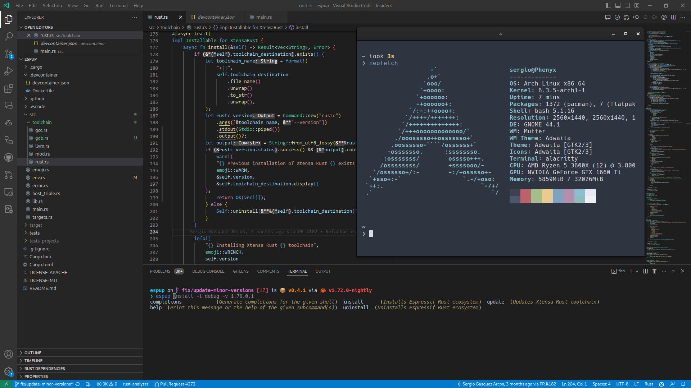
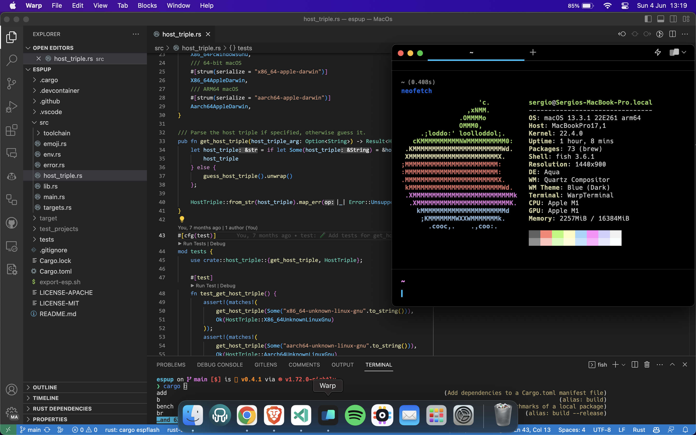
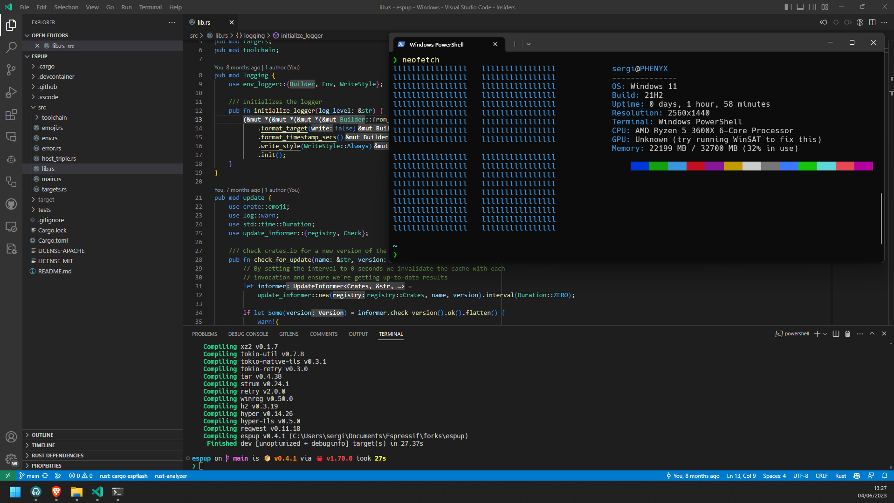

# Dotfiles
Cozy repository where I store my dotfiles:
- [Linux (Arch Linux)](linux)
- [macOS](mac-os)
- [Windows](windows)
- [Pi coding agent](common/pi)
- [Media server](mediaserver)

Linux and Windows are installed in a dual boot environment, see [Installation Guide](InstallationGuide.md) for instructions.

## [Linux (Arch Linux)](linux)



## [macOS](mac-os)



## [Windows](windows)



## Linux and macOS setup

After the platform setup steps in the [Linux](linux#setup-dotfiles) or
[macOS](mac-os#setup-dotfiles) README, run these commands in Bash from the
repository root:

1. Install the extra crates, preserving any arguments on each line:
   ```bash
   cd "$HOME/.dotfiles"
   while IFS= read -r line; do
       read -r -a crate_args <<< "$line"
       cargo install "${crate_args[@]}"
   done < common/rust/crates
   ```
2. Install the Espressif Rust toolchains and generate the export file used by
   Fish:
   ```bash
   espup install
   ```
3. Install [Pi](https://pi.dev/docs/latest/quickstart#install):
   ```bash
   npm install -g --ignore-scripts @earendil-works/pi-coding-agent
   ```
4. Regenerate the Fish completions:
   ```bash
   espup completions fish > common/shell/espup.fish
   espflash completions fish > common/shell/espflash.fish
   ```
   `cargo-espflash` completions must still be added to Fish's `cargo`
   completions manually; avoid appending them more than once.
5. Check that all managed links are correct:
   ```bash
   dot -v check
   ```

### Remote probe-rs

`$HOME/.probe-rs.toml` defines `<chip>-hil` presets that connect to
`ssh://hil-<chip>:3000`. Keep the private details out of this repository:

- Define each `hil-<chip>` host alias, with its user and jump host, in
  `~/.ssh/config`.
- If the runners require a token, set `PROBE_RS_REMOTE_TOKEN` in the ignored
  `common/shell/espressif.fish`.

Then run `probe-rs <command> --preset esp32c6-hil`, or set
`PROBE_RS_CONFIG_PRESET` for tools such as `esp-devtool`.
