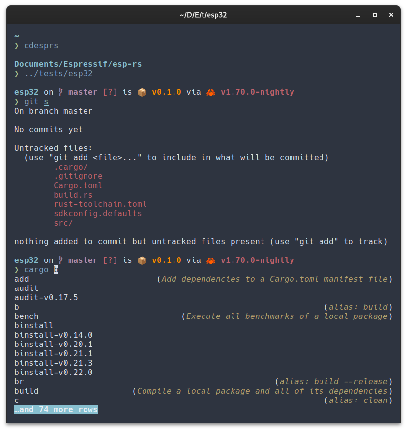
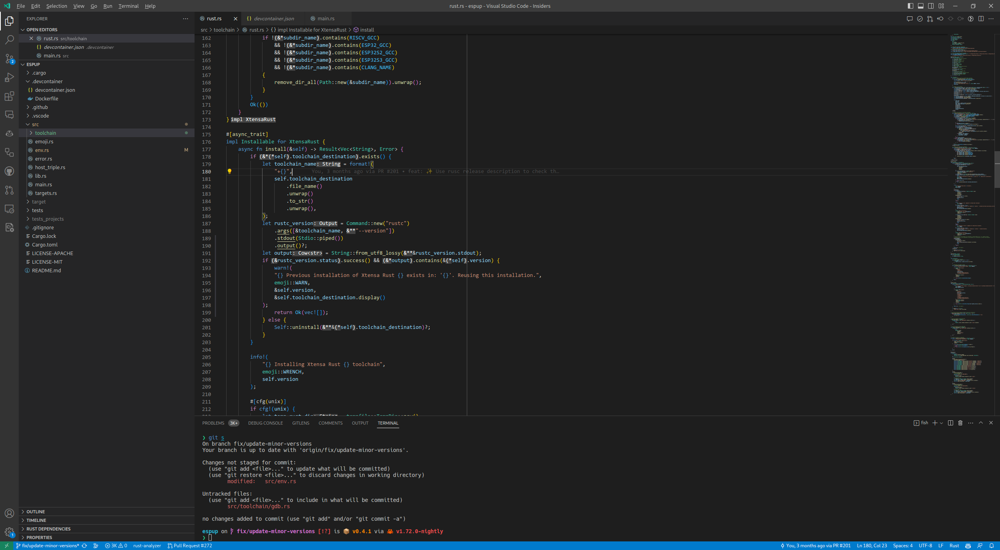

# Linux (Arch Linux)
Dotfiles for Arch Linux enviroment.

- Terminal:
  - [Alacritty](https://alacritty.org/) as terminal
  - [Starship](https://starship.rs/) as prompt
  - Fish as shell

- IDE:
  - [VS Code](https://code.visualstudio.com/) as IDE
  - Terminal is also using Starship and Fish

## Makefile
### Targets
* `git`: Configures git
* `install-packages`: Installs all the packages
* `network`: Configures Google DNS
* `remove-packages`: Removes unnecessary packages installed with gnome
* `rust`: Configures Rust aliases and installs crates
* `shell`: Configures Fish
* `terminal`: Configures Alacritty
* `udev`: Configures OpenOCD (https://docs.espressif.com/projects/esp-idf/en/release-v5.1/esp32c2/api-guides/jtag-debugging/configure-other-jtag.html) and probe-rs(https://probe.rs/docs/getting-started/probe-setup/#udev-rules) udev rules
* `vscode`: Configures VS Code settings
  > **Note**
  > This is step is not required since loging into VS Code syncs keybingins and settings.

