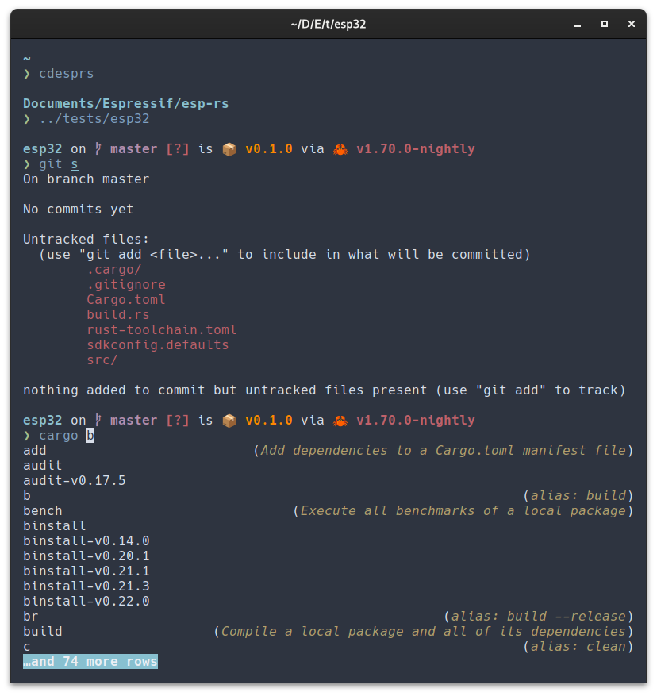
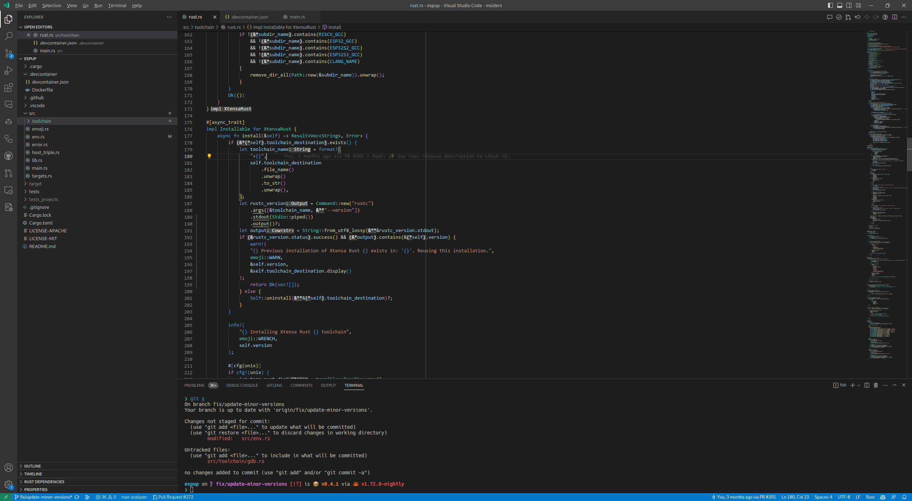

# Linux (Arch Linux)
Dotfiles for Arch Linux environment.

- Terminal:
  - [Alacritty](https://alacritty.org/) as terminal
  - [Starship](https://starship.rs/) as prompt
  - Fish as shell



- IDE:
  - [Zed](https://zed.dev/) as IDE
  - Terminal is also using Starship and Fish



## Setup Dotfiles

1. [Install Rust](https://www.rust-lang.org/tools/install)
    ```
    curl --proto '=https' --tlsv1.2 -sSf https://sh.rustup.rs | sh
    ```
2. Install extra crates:
    ```
    cat ../common/rust/crates | while IFS= read -r line; do read -r crate arguments <<< "$line"; cargo install "$crate" $arguments; done
    ```
3. Install Espressif Rust toolchains and generate the export file used by Fish:
    ```
    espup install
    ```
4. Install extra packages:
    ```
    paru --needed -S - < packages
    ```
5. Remove unnecessary packages:
    ```
    paru --noconfirm -R - < packages-to-delete
    ```
6. Initialize dotfiles and check if all the links exist and are correct
    ```
    dot init SergioGasquez/dotfiles
    dot -v check
    ```
7. Add [command completions](https://github.com/esp-rs/espflash/pull/388):
   1. Regenerate completions using: `comp` alias
   2. If there is any Cargo subcommand completions, add the manually. Eg `sudo cat cargo-espflash.fish >> /usr/share/fish/completions/cargo.fish`
