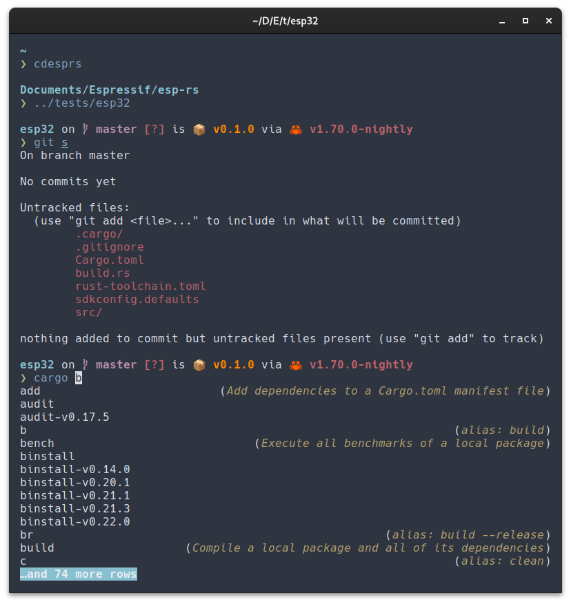
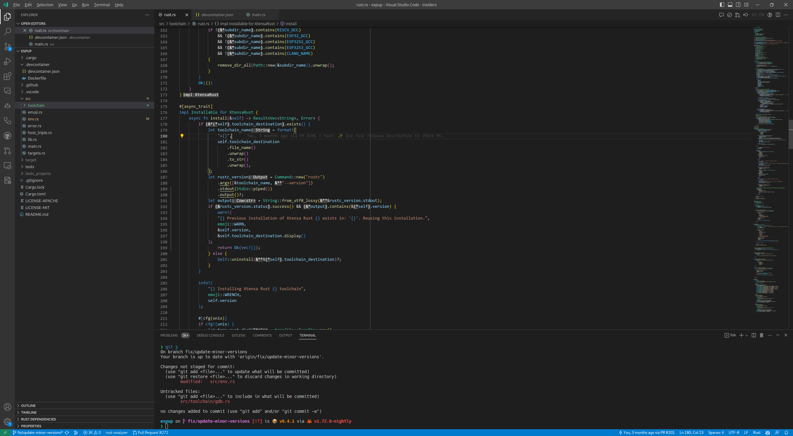

# Linux (Arch Linux)
Dotfiles for Arch Linux environment.

- Terminal:
  - [Alacritty](https://alacritty.org/) and [Ghostty](https://ghostty.org/) as terminals
  - [Starship](https://starship.rs/) as prompt
  - Fish as shell



Ghostty's config is managed at `~/.config/ghostty/config`, based on
[davidgasquez/dotfiles](https://github.com/davidgasquez/dotfiles/blob/main/terminal/ghostty/config),
and launches Fish by default with a GTK title bar and window controls.
After linking with `dot`, install Ghostty with `paru --needed -S ghostty` if
not installing the full package list.

- IDE:
  - [Cursor](https://www.cursor.com/) and [Zed](https://zed.dev/) as IDEs
  - Terminal is also using Starship and Fish



## Setup Dotfiles

This setup assumes the Linux steps in the
[Installation Guide](../InstallationGuide.md) are complete. Run these commands
in Bash. The repository is installed at `$HOME/.dotfiles`.

1. [Install Rust](https://www.rust-lang.org/tools/install):
   ```bash
   curl --proto '=https' --tlsv1.2 -sSf https://sh.rustup.rs | sh
   source "$HOME/.cargo/env"
   ```
2. Install `dot`, initialize the repository, and enter the Linux directory:
   ```bash
   cargo install --git https://github.com/ubnt-intrepid/dot.git
   dot init SergioGasquez/dotfiles
   cd "$HOME/.dotfiles/linux"
   ```
3. Install the system packages before building the remaining Rust tools:
   ```bash
   paru --needed -S - < packages
   ```
4. Install the extra crates, preserving any arguments on each line:
   ```bash
   while IFS= read -r line; do
       read -r -a crate_args <<< "$line"
       cargo install "${crate_args[@]}"
   done < ../common/rust/crates
   ```
5. Install the Espressif Rust toolchains and generate the export file used by Fish:
   ```bash
   espup install
   ```
6. Remove unwanted packages:
   ```bash
   paru --noconfirm -R - < packages-to-delete
   ```
7. Install [Pi](https://pi.dev/docs/latest/quickstart#install):
   ```bash
   npm install -g --ignore-scripts @earendil-works/pi-coding-agent
   ```
8. Regenerate the Fish completions:
   ```bash
   espup completions fish > ../common/shell/espup.fish
   espflash completions fish > ../common/shell/espflash.fish
   ```
9. Check that all managed links are correct:
   ```bash
   dot -v check
   ```

`cargo-espflash` completions must still be added to Fish's `cargo`
completions manually; avoid appending them more than once.
