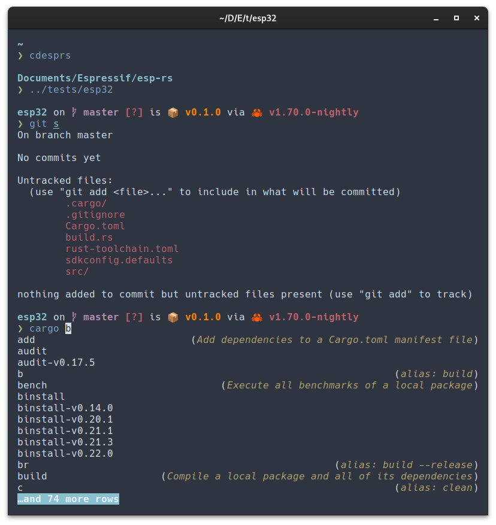
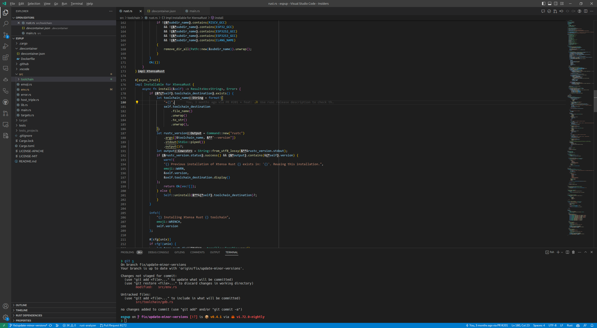

# Linux (Arch Linux)
Dotfiles for Arch Linux environment.

- Terminal:
  - [Ghostty](https://ghostty.org/) as terminal
  - [Starship](https://starship.rs/) as prompt
  - Fish as shell



Ghostty's config is shared with macOS from `common/ghostty/config`, managed at
`~/.config/ghostty/config`, based on
[davidgasquez/dotfiles](https://github.com/davidgasquez/dotfiles/blob/main/terminal/ghostty/config),
and uses a GTK title bar and window controls. Ghostty launches the login shell,
so set Fish with `chsh -s /usr/bin/fish`. New Ghostty windows start in the home
directory; tabs and splits can still inherit their parent directory.
After linking with `dot`, install Ghostty with `paru --needed -S ghostty` if
not installing the full package list.

- IDE:
  - [Zed](https://zed.dev/) as the default IDE, with [Cursor](https://www.cursor.com/) also installed
  - Terminal is also using Starship and Fish



## Setup Dotfiles

This setup assumes the Linux steps in the
[Installation Guide](../InstallationGuide.md) are complete. Run these commands
in Bash. The repository is installed at `$HOME/.dotfiles`.

1. [Install Rust](https://www.rust-lang.org/tools/install):
   ```bash
   curl --proto '=https' --tlsv1.2 -sSf https://sh.rustup.rs | sh
   source "$HOME/.cargo/env"
   ```
2. Install `dot`, initialize the repository, and enter the Linux directory:
   ```bash
   cargo install --git https://github.com/ubnt-intrepid/dot.git
   dot init SergioGasquez/dotfiles
   cd "$HOME/.dotfiles/linux"
   ```
3. Install the system packages before building the remaining Rust tools:
   ```bash
   paru --needed -S - < packages
   ```
4. Remove unwanted packages:
   ```bash
   paru --noconfirm -R - < packages-to-delete
   ```
5. Continue with the [Linux and macOS setup](../README.md#linux-and-macos-setup).
