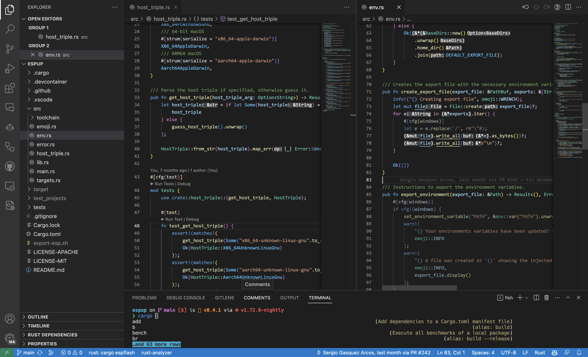

# macOS
Dotfiles for macOS environment.

- Terminal:
  - [Warp](https://www.warp.dev/) as terminal
  - Fish as shell


- IDE:
  - [VS Code Insiders](https://code.visualstudio.com/insiders/) as IDE
  - Terminal is also using Starship and Fish



## Setup Dotfiles

1. [Install Rust](https://www.rust-lang.org/tools/install)
    ```
    curl --proto '=https' --tlsv1.2 -sSf https://sh.rustup.rs | sh
    ```
2. Install extra crates:
    ```
    while IFS= read -r line; do crate="${line%% *}"; args="${line#* }"; cargo install "$crate" $args; done < ../common/rust/crates
    ```
3. [Install brew](https://brew.sh/):
    ```
    /bin/bash -c "$(curl -fsSL https://raw.githubusercontent.com/Homebrew/install/HEAD/install.sh)"
    ```
4. Install extra packages:
    ```
    cat packages | xargs -I {} brew install {}
    ```
5. Initialize dotfiles and check if all the links exist and are correct
    ```
    dot init SergioGasquez/dotfiles
    dot -v check
    ```

