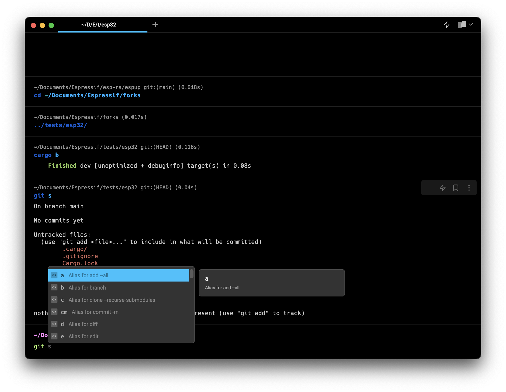
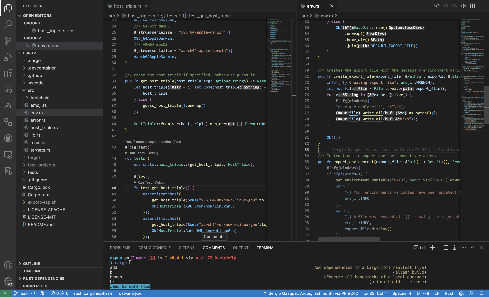

# macOS
Dotfiles for macOS environment.

- Terminal:
  - [Warp](https://www.warp.dev/) as terminal
  - Fish as shell



- IDE:
  - [Cursor](https://www.cursor.com/) and [Zed](https://zed.dev/) as IDEs
  - Terminal is also using Starship and Fish



## Setup Dotfiles

Run these commands in Bash. The repository is installed at `$HOME/.dotfiles`.

1. [Install Homebrew](https://brew.sh/) and follow the PATH instructions printed
   by the installer:
   ```bash
   /bin/bash -c "$(curl -fsSL https://raw.githubusercontent.com/Homebrew/install/HEAD/install.sh)"
   ```
2. [Install Rust](https://www.rust-lang.org/tools/install):
   ```bash
   curl --proto '=https' --tlsv1.2 -sSf https://sh.rustup.rs | sh
   source "$HOME/.cargo/env"
   ```
3. Install `dot`, initialize the repository, and enter the macOS directory:
   ```bash
   cargo install --git https://github.com/ubnt-intrepid/dot.git
   dot init SergioGasquez/dotfiles
   cd "$HOME/.dotfiles/mac-os"
   ```
4. Install the system packages before building the remaining Rust tools:
   ```bash
   while IFS= read -r package; do
       [ -n "$package" ] && brew install "$package"
   done < packages
   ```
5. Install the extra crates, preserving any arguments on each line:
   ```bash
   while IFS= read -r line; do
       read -r -a crate_args <<< "$line"
       cargo install "${crate_args[@]}"
   done < ../common/rust/crates
   ```
6. Install the Espressif Rust toolchains and generate the export file used by
   Fish:
   ```bash
   espup install
   ```
7. Install [Pi](https://pi.dev/docs/latest/quickstart#install):
   ```bash
   npm install -g --ignore-scripts @earendil-works/pi-coding-agent
   ```
8. Regenerate the Fish completions:
   ```bash
   espup completions fish > ../common/shell/espup.fish
   espflash completions fish > ../common/shell/espflash.fish
   ```
9. Check that all managed links are correct:
   ```bash
   dot -v check
   ```

