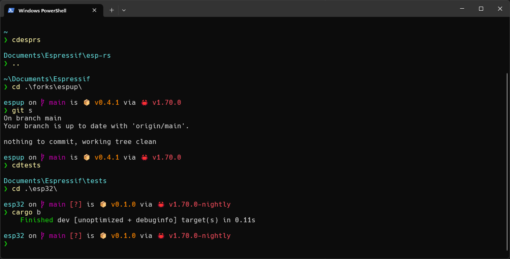
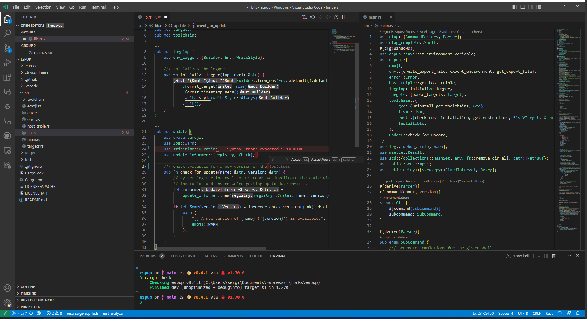

# Windows
Dotfiles for Windows enviroment.

- Terminal:
  - [Windows Terminal](https://apps.microsoft.com/store/detail/windows-terminal/9N0DX20HK701?hl=es-es&gl=es) as terminal
  - [Starship](https://starship.rs/) as prompt
  - Powershell as shell



- IDE:
  - [VS Code Insiders](https://code.visualstudio.com/insiders/) as IDE
  - Terminal is also using Starship and Powershell



## Winget
1. [Install Winget](https://learn.microsoft.com/en-us/windows/package-manager/winget/#install-winget)
    > **Note**
    > [Winget package registry browser](https://winget.run/)
1. Install software:
   ```powershell
   Get-Content ".\packages" | ForEach-Object {  Write-Host "- Installing $_"; winget install --accept-package-agreements --accept-source-agreements $_ }
   ```

## Starship
1. Update execution policies:
    ```powershell
    Set-ExecutionPolicy -ExecutionPolicy RemoteSigned
    ```
2. Create symbolic link for $PROFILE (Use privileged terminal)
    ```powershell
    $sourceFile = ".\shell\Microsoft.PowerShell_profile.ps1"; $destinationFile = "C:\Users\sergi\Documents\WindowsPowerShell\Microsoft.PowerShell_profile.ps1"; if (-not (Test-Path -Path $destinationFile)) { New-Item -ItemType File -Path $destinationFile -Force }; New-Item -ItemType SymbolicLink -Path $destinationFile -Value $sourceFile -Force; Write-Host "Symbolic link created from $destinationFile to $sourceFile"
    ```

## Rust
1. [Install Rust](https://www.rust-lang.org/tools/install)
2. Create symbolic link for Cargo config file (Use privileged terminal):
    ```powershell
    $sourceFile = "..\common\rust\config.toml"; $destinationFile = "C:\Users\sergi\.cargo\config.toml"; if (-not (Test-Path -Path $destinationFile)) { New-Item -ItemType File -Path $destinationFile -Force }; New-Item -ItemType SymbolicLink -Path $destinationFile -Value $sourceFile -Force; Write-Host "Symbolic link created from $destinationFile to $sourceFile"
    ```
3. Install useful crates:
    ```powershell
    Get-Content -Path "..\common\rust\crates" | ForEach-Object { $crate, $arguments = $_.split(" ", 2); cargo install $crate $arguments }
    ```

## Git
1. Create symbolic link for Git config file (Use privileged terminal):
    ```powershell
    $sourceFile = "..\common\gitconfig"; $destinationFile = "C:\Users\sergi\.gitconfig"; if (-not (Test-Path -Path $destinationFile)) { New-Item -ItemType File -Path $destinationFile -Force }; New-Item -ItemType SymbolicLink -Path $destinationFile -Value $sourceFile -Force; Write-Host "Symbolic link created from $destinationFile to $sourceFile"
    ```

## VS Code
1. Create symbolic link for VS Code config files (Use privileged terminal):
    ```powershell
    $sourceFile = "..\common\vscode\keybindings.json"; $destinationFile = "C:\Users\sergi\AppData\Roaming\Code\User\keybindings.json"; if (-not (Test-Path -Path $destinationFile)) { New-Item -ItemType File -Path $destinationFile -Force }; New-Item -ItemType SymbolicLink -Path $destinationFile -Value $sourceFile -Force; Write-Host "Symbolic link created from $destinationFile to $sourceFile"
    $sourceFile = "..\common\vscode\settings.json"; $destinationFile = "C:\Users\sergi\AppData\Roaming\Code\User\settings.json"; if (-not (Test-Path -Path $destinationFile)) { New-Item -ItemType File -Path $destinationFile -Force }; New-Item -ItemType SymbolicLink -Path $destinationFile -Value $sourceFile -Force; Write-Host "Symbolic link created from $destinationFile to $sourceFile"
    ```
    > **Note**
    > This is step is not required since loging into VS Code syncs keybingins and settings.


## [PowerToys](https://github.com/microsoft/PowerToys)
1. Disable `Win+Space` shorcut
    - Open PowerToys > Keyboard manager > Enable it > Remap a shorcut
      - Select: `Win (Left) + Space`
      - To send: `Disable`

## Nvidia GeForce
1. Disable Perfomance Overlay: Settings > General > turn off In-game Overlay
