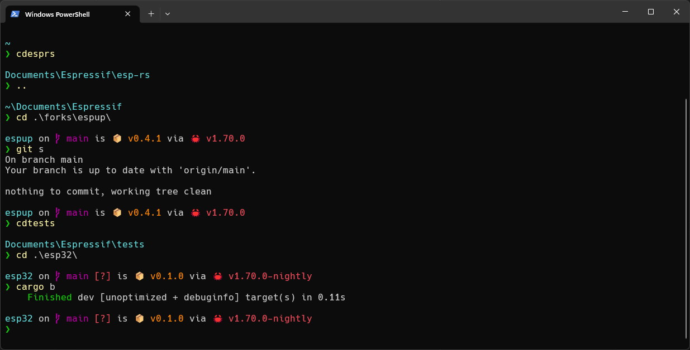
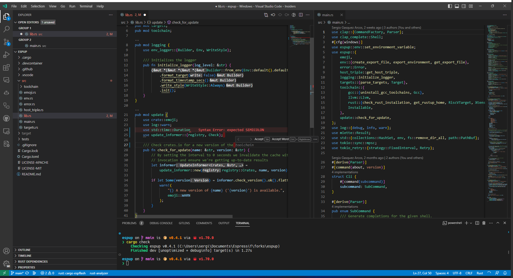

# Windows
Dotfiles for Windows environment.

- Terminal:
  - [Windows Terminal](https://apps.microsoft.com/store/detail/windows-terminal/9N0DX20HK701?hl=es-es&gl=es) as terminal
  - [Starship](https://starship.rs/) as prompt
  - PowerShell as shell



- IDE:
  - [Cursor](https://www.cursor.com/) and [Zed](https://zed.dev/) as IDEs
  - Terminal is also using Starship and PowerShell



## Setup Dotfiles

This setup assumes the Windows steps in the
[Installation Guide](../InstallationGuide.md) are complete and `winget` is
available. Run these commands in Windows PowerShell. The repository is
installed at `$HOME\.dotfiles`.

1. Install Git, then open a new PowerShell session:
   ```powershell
   winget install --id Git.Git --exact --accept-package-agreements --accept-source-agreements
   ```
2. [Install Rust](https://www.rust-lang.org/tools/install), including the
   recommended MSVC build prerequisites.
3. Install `dot`, initialize the repository, and enter the Windows directory:
   ```powershell
   cargo install --git https://github.com/ubnt-intrepid/dot.git
   dot init SergioGasquez/dotfiles
   Set-Location "$HOME\.dotfiles\windows"
   ```
4. Install the system packages before building the remaining Rust tools:
   ```powershell
   Get-Content ".\packages" |
       Where-Object { $_.Trim() } |
       ForEach-Object {
           winget install --id $_ --exact --accept-package-agreements --accept-source-agreements
       }
   ```
5. Install the extra crates, preserving any arguments on each line:
   ```powershell
   Get-Content "..\common\rust\crates" | ForEach-Object {
       $crateArguments = $_ -split '\s+'
       cargo install @crateArguments
   }
   ```
6. Install the Espressif Rust toolchains and generate the PowerShell export
   file:
   ```powershell
   espup install
   ```
7. Install [Pi](https://pi.dev/docs/latest/quickstart#install):
   ```powershell
   npm install -g --ignore-scripts @earendil-works/pi-coding-agent
   ```
8. Regenerate the PowerShell completions:
   ```powershell
   . $PROFILE
   completions
   ```
9. From a privileged PowerShell session, check that all managed links are
   correct:
   ```powershell
   dot -v check
   ```
   Verify that the Windows Terminal `settings.json` path in `.mappings` is
   correct for the installed distribution. See the
   [Windows Terminal settings location](https://learn.microsoft.com/en-us/windows/terminal/install#settings-json-file).
10. Install a [Nerd Font](https://starship.rs/guide/#%F0%9F%9A%80-installation)
   for Starship and select it in Windows Terminal. This configuration uses
   Hack Nerd Font.
